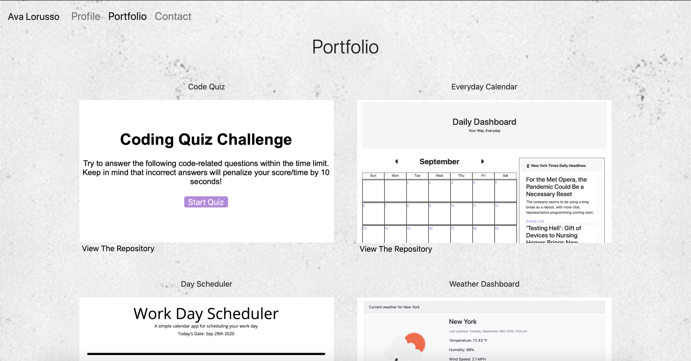

<h2>Welcome to my Portfolio!</h2>

In this assignment, I created a fully functioning webpage with three sections: a profile, a portfolio, and a contact page.

In the Profile page, I added a card that hosts links to my GitHub, LinkedIn, AngelList, along with a direct description of my role in web development and where I am currently studying. In addition to that, there is a button to download a pdf of my most updated resume.

The Portfolio page has 4 clickable images that direct the user directly to my best live webpages. Underneath them is a link to view the perspective repository on GitHub.

The last page is my first ever functioning Contact page, which includes an operating form where the user can enter their name, email, and message they wish to send me. This active form is hosted through FormSpree

This project mainly uses HTML, CSS, and BootStrap, but JavaScript was also utilized.

<h3>Images</h3>

<h3>License</h3>

Live Link: https://avatl.github.io/
